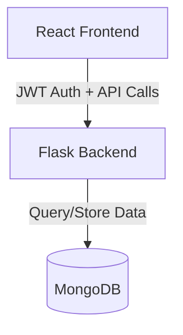

# Nested Commenting System

A full-stack application implementing a nested commenting system with JWT authentication.

## System Architecture



## Features

- User Authentication (JWT)
- Nested Comments
- Real-time Comment Updates
- Secure API Endpoints
- Responsive UI

## Tech Stack

- Frontend: React + Vite + TailwindCSS
- Backend: Python Flask
- Database: MongoDB
- Authentication: JWT

## Prerequisites

- Node.js v18+
- Python 3.8+
- MongoDB 5.0+

## Installation

### Backend Setup

```bash
cd Backend
pip install -r requirements.txt
flask --app app run --debug
```

### Frontend Setup

```bash
cd Frontend
npm install
npm run dev
```

### MongoDB Setup

1. Install MongoDB
2. Create database: Nested-Commenting-System
3. Collections needed: users, comments

## API Documentation

See [API_DOCS.md](./docs/API_DOCS.md) for detailed API documentation.

## Database Schema

See [DATABASE.md](./docs/DATABASE.md) for database schema documentation.

## Authentication Flow

See [AUTH_FLOW.md](./docs/AUTH_FLOW.md) for authentication documentation.
