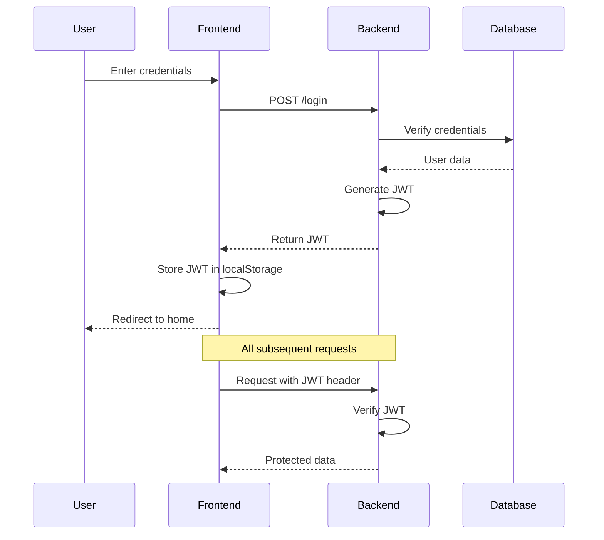

# Authentication Flow Documentation

## JWT Authentication Flow



## Security Measures

1. Password Hashing

- Uses Werkzeug's password hashing
- Salted hashes
- Secure password storage

2. JWT Implementation

- 1-hour token expiration
- Secure secret key
- Token blacklisting on logout

3. Protected Routes

- Frontend route guards
- Backend middleware verification
- Token validation on each request

## Code Implementation

### Frontend Token Management

```javascript
// Store token
localStorage.setItem("token", response.data.token);

// Add token to requests
axios.defaults.headers.common["Authorization"] = `Bearer ${token}`;

// Remove token on logout
localStorage.removeItem("token");
```

### Backend Token Verification

```python
@staticmethod
def get_user_from_token(token):
    try:
        if token.startswith('Bearer '):
            token = token.split(' ')[1]

        payload = jwt.decode(token, SECRET_KEY, algorithms=["HS256"])
        user = User.find_by_email(payload["email"])
        return str(user["_id"])
    except jwt.ExpiredSignatureError:
        raise Exception("Token expired")
    except jwt.InvalidTokenError:
        raise Exception("Invalid token")
```
