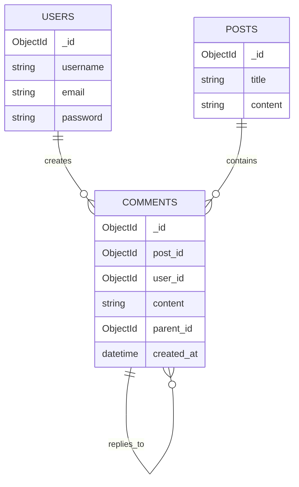

# Database Documentation

## MongoDB Schema

### Users Collection

```json
{
  "_id": ObjectId,
  "username": String,
  "email": String,
  "password": String // Hashed password
}
```

Indexes:

- email (unique)

### Comments Collection

```json
{
  "_id": ObjectId,
  "post_id": ObjectId,
  "user_id": ObjectId,
  "content": String,
  "parent_id": ObjectId, // null for root comments
  "created_at": DateTime
}
```

Indexes:

- post_id
- parent_id
- user_id

## Data Flow Diagram


